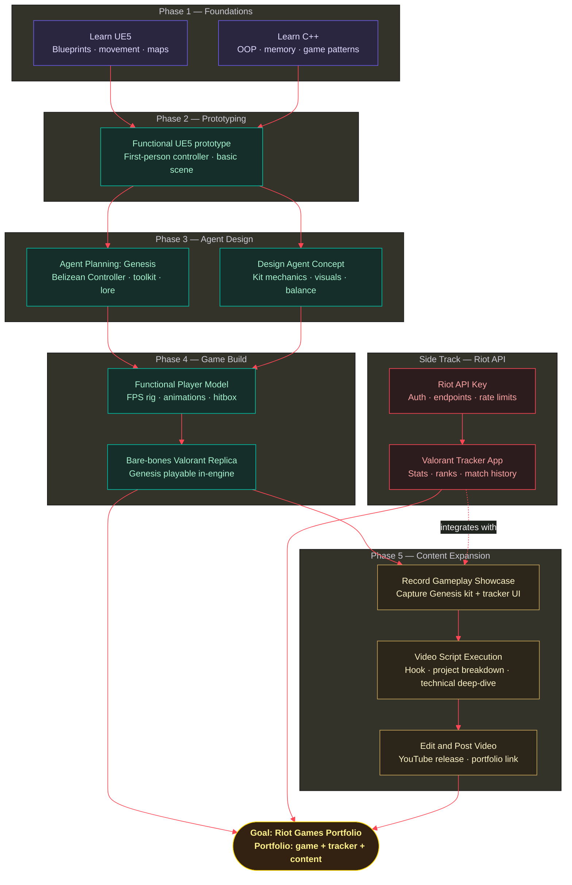

# Riot 
I had a dream.
I was lazy.
 I always thought I would work hard when I grew up.
 I always thought I'll put effort when it matters. 
 Now I know. 
 Now is all that matters,
 And all I want right now is to get into RIOT.

## Links
[Agent planning](https://docs.google.com/document/d/1vGnSk40fjbgmQI5ZqUuRZxLUeQVUPWlWfQGAfZToDHU/edit?usp=sharing)
[Video Script Planning](https://docs.google.com/document/d/1fuRnrWFvWlfO56szch4ggAWZeI4g-fNL1pPCX4eLr6Y/edit?usp=sharing)

 
 ## RoadMap ---[Lets do this]-->
My genius plan to get to Riot starts with determination 

